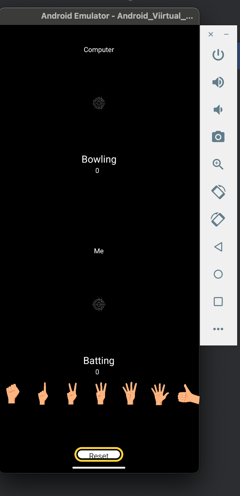
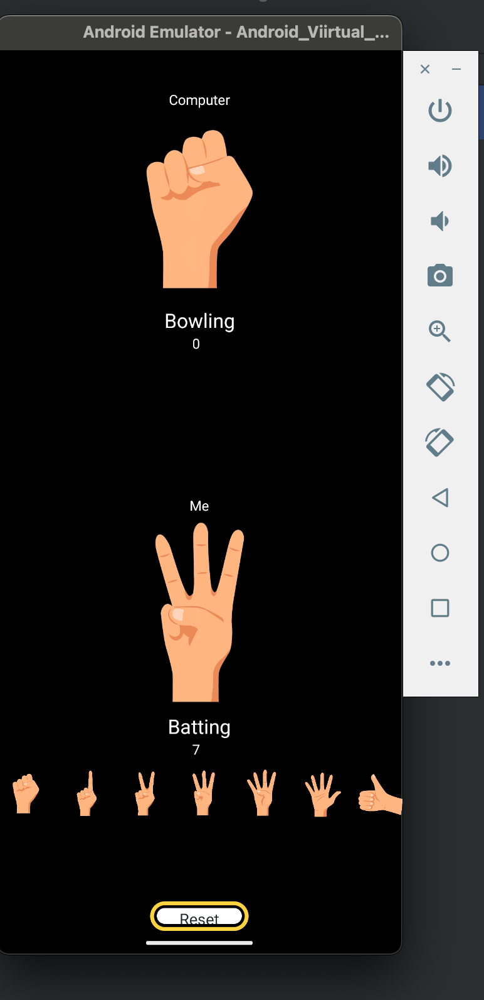
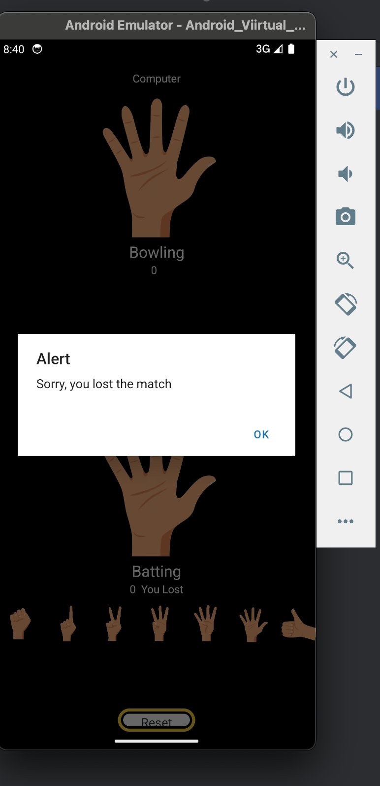

# Hand Cricket App

This is a hand cricket game built using React Native. The game allows the user to play against the computer by selecting an image representing the score.

## Table of Contents
- [Hand Cricket App](#hand-cricket-app)
  - [Table of Contents](#table-of-contents)
  - [Installation](#installation)
  - [Usage](#usage)
  - [Game Rules](#game-rules)
  - [Components](#components)
    - [App.js](#appjs)
    - [Cricket.js](#cricketjs)
  - [Screenshots](#screenshots)
  - [Contributing](#contributing)
  - [License](#license)

## Installation

1. Clone the repository:
    ```sh
    git clone https://github.com/pavankumart18/hand-cricket-app.git
    ```
2. Navigate to the project directory:
    ```sh
    cd hand-cricket-app
    ```
3. Install the dependencies:
    ```sh
    npm install
    ```

## Usage

1. Start the app:
    ```sh
    npx expo start
    ```
2. Open the app in an emulator or on a physical device using the Expo app.
3. Press "a" to see in android emulator app
4. Press "w" to play using web

## Game Rules

- The game is played between the user and the computer.
- The user selects an image representing a score (0-6).
- The computer randomly generates a score.
- If the scores match, the turn changes.
- The game continues until a player wins by having a higher score after an even number of turns.

## Components

### App.js

This is the main component that manages the game state and renders the `Cricket` components for both the user and the computer.

### Cricket.js

This component displays the current score, the selected image, and a list of selectable images for the user.

## Screenshots





## Contributing

1. Fork the repository.
2. Create a new branch: `git checkout -b my-feature-branch`
3. Make your changes and commit them: `git commit -m 'Add some feature'`
4. Push to the branch: `git push origin my-feature-branch`
5. Submit a pull request.

## License

This project is licensed under the MIT License.
